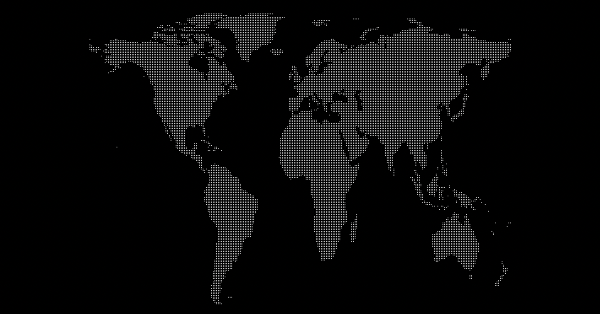
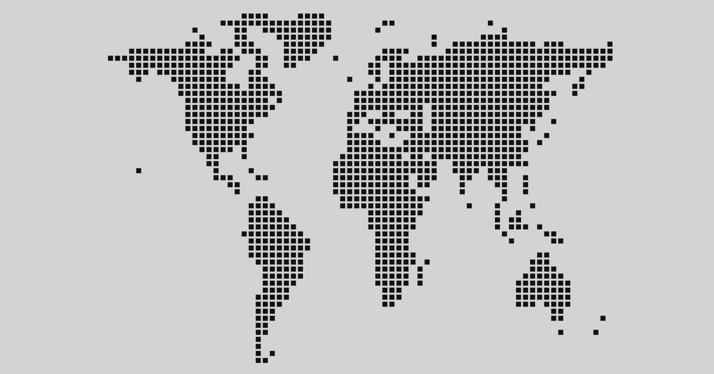
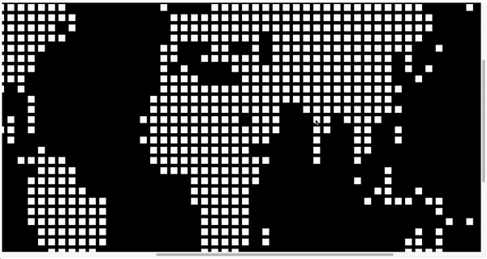
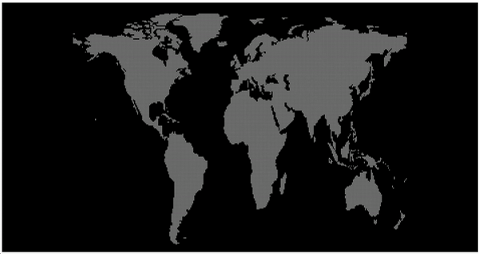

# dot-map-renderer








dot-map-renderer is a library that draws pointmaps according to screen size and screen enlargement. <br/>
dot-map-renderer is a pure project, without dependency, hence a very light library.

## Environments in which to use dot-map
- Browser - chorme

## About This Repository
dot-map-renderer uses a monorepo approach, so in addition to the dot-map-renderer NPM module, this repository contains code for a few closely related projects and some pieces of dot-map-renderer which are published as standalone modules,

- [`packages/app`](https://github.com/bigshelf/dot-map-renderer/tree/master/packages/app)
[](https://packagephobia.com/result?p=@dot-map-renderer/app)
- [`packages/react`](https://github.com/bigshelf/dot-map-renderer/tree/master/packages/react)
[](https://packagephobia.com/result?p=@dot-map-renderer/react)
- [`packages/component`](https://github.com/bigshelf/dot-map-renderer/tree/master/packages/component)
[](https://packagephobia.com/result?p=@dot-map-renderer/component)

## Installation

```shell
npm i @dot-map-renderer/app
```


## Getting started

### ES

```typescript
import { DotMap } from "@dot-map-renderer/app"

const $body = document.querySelector('body');

const dotMap = new DotMap({
    dotType: 'rectangular',
    backgroundColor: 'blue',
    pixelSize: 5,
    gapSize: 8,
});

dotMap.attaching($body);

const {controller} = dotMap;

controller.addAnchors([13,81]);
controller.addAnchors([13,43]);
controller.addAnchors([13,13]);
controller.addAnchors([13,30]);
```
### REACT

```
npm install @dot-map-renderer/react @dot-map-renderer/app
```

```typescript


import React, { ChangeEvent, ChangeEventHandler, useState } from 'react';
import { ReactDotMap } from '@dot-map-renderer/react';

function App()
{
    const [backgroundColor, setBackgroundColor] = useState<string>('');
    const [gapSize, setGapSize] = useState<number>(5);

    const onChangeBackgroundColor: ChangeEventHandler = (e: ChangeEvent<HTMLInputElement>) => {
        setBackgroundColor(e.target.value);
    }

    const onChangeGapSize: ChangeEventHandler = (e: ChangeEvent<HTMLInputElement>) => {
        setGapSize(parseInt(e.target.value));
    }


    return <div>
        backgroundColor
        <input onChange={onChangeBackgroundColor}/>
        <br/>
        gapSize
        <input onChange={onChangeGapSize}/>
        <ReactDotMap
            anchors={[]}
            lines={[]}
            backgroundColor={backgroundColor}
            gapSize={gapSize}
        />
    </div>
}

export default App;
```


## How to build

```shell
npm run build
```
